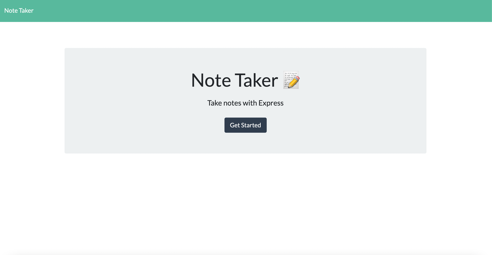
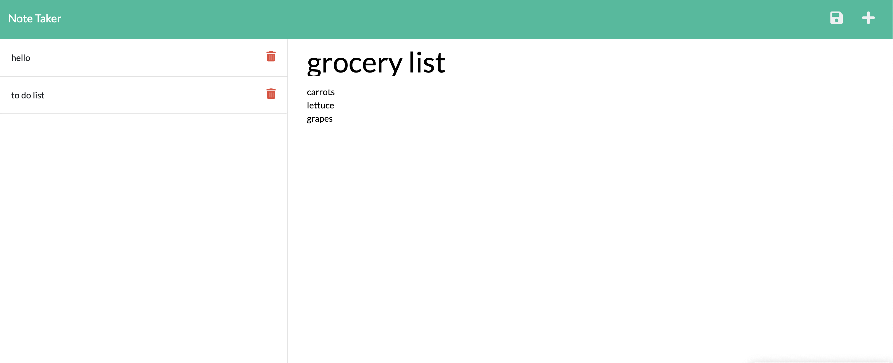

# note-taker

  ## Description
  Note Taker is an application that can be used to write and save notes. A Save icon will appear in navigation at the top of page as a user enters a new note title with text. This application will save and retrieve note data from a JSON file and will use an Express.js back end.
  ## Table of Contents

  * [Usage](#usage)
  * [Contributing](#contributing)
  * [Tests](#tests)
  * [Questions](#questions)

  ## Usage
  
    The following image shows the web application's appearance:

  ## Contributing
  N/A

  ## Test 
  Run 'npm run develop' in terminal.

  ## Questions
  If you have any questions about the application, please contact me at babylexi710@gmail.com.
  Find me on GitHub: [Babylex710](https://github.com/Babylex710)